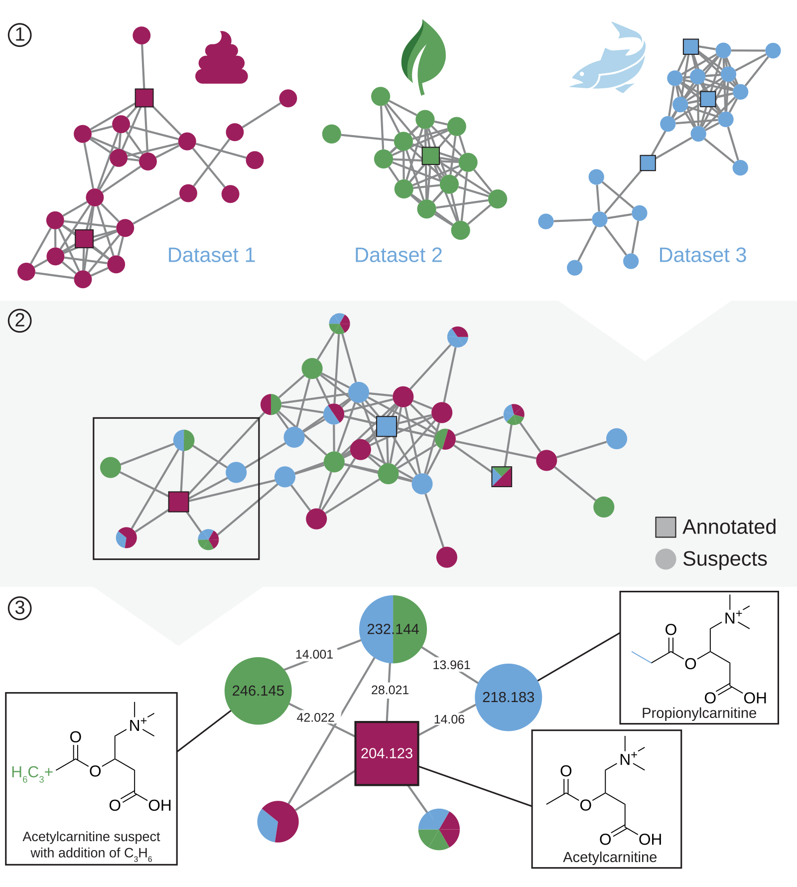

Nearest neighbor suspect spectral library
=========================================

For more information:

* [Official code website](https://github.com/bittremieux/gnps_suspect_library)

The nearest neighbor suspect spectral library is a spectral library that was created in a data-driven fashion by propagating annotations from hundreds of millions of public mass spectra to molecules that are structurally related to previous reference molecules using MS/MS based spectral alignment.
It is a freely available resource provided through the [GNPS](https://gnps.ucsd.edu/) platform to help investigators hypothesize candidate structures for unknown MS/MS spectra in their untargeted metabolomics data.



All code is available as open-source under the BSD license.

If you use the nearest neighbor suspect spectral library in your work, please cite the following publication:

- Bittremieux, W. _et al._ Open access repository-scale propagated nearest neighbor suspect spectral library for untargeted metabolomics. _bioRxiv_ (2022) doi:[10.1101/2022.05.15.490691](https://doi.org/10.1101/2022.05.15.490691).

Nearest neighbor suspect spectral library generation
----------------------------------------------------

Generating the nearest neighbor suspect spectral library requires Python 3.8. You can create a suitable code environment and install all dependencies using conda:

```
conda env create -f https://raw.githubusercontent.com/bittremieux/gnps_suspect_library/master/environment.yml && conda activate suspect_library
```

See the `environment.yml` file for full details on the software dependencies.

You can generate the nearest neighbor suspect spectral library from the GNPS living data analysis results by cloning the repository and running the main Python script:

```
git clone https://github.com/bittremieux/gnps_suspect_library.git && cd gnps_suspect_library/src
python3 suspects.py
```

This will create Parquet files that include tabular information and provenance for all the suspect MS/MS spectra. Compiling an MS/MS spectral library MGF file from the Parquet metadata file can be done using the `export_mgf.ipynb` Jupyter notebook in the `notebooks` directory.

The Jupyter notebooks in the `notebooks` directory can also be used to fully recreate all analyses reported in the manuscript.


Contact
-------

For more information you can visit the [official code website](https://github.com/bittremieux/gnps_suspect_library) or send an email to <wbittremieux@health.ucsd.edu>.
