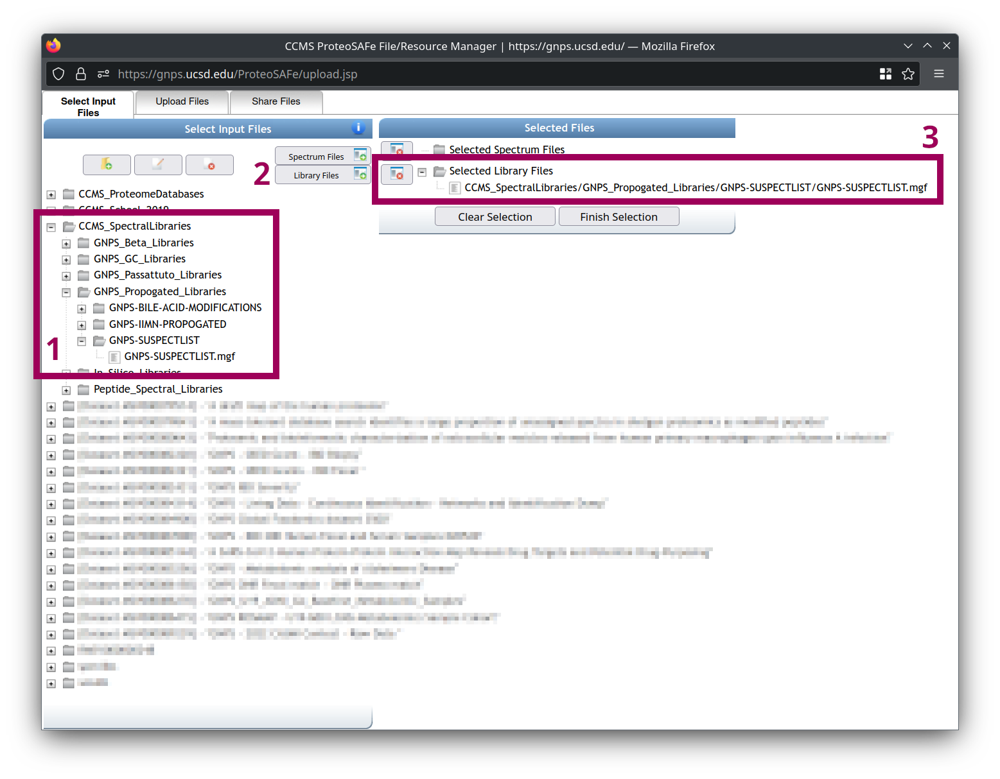

Nearest neighbor suspect spectral library
=========================================

For more information:

* [Official code website](https://github.com/bittremieux/gnps_suspect_library)

The nearest neighbor suspect spectral library is a spectral library that was created in a data-driven fashion by propagating annotations from hundreds of millions of public mass spectra to molecules that are structurally related to previous reference molecules using MS/MS based spectral alignment.
It is a freely available resource provided through the [GNPS](https://gnps.ucsd.edu/) platform to help investigators hypothesize candidate structures for unknown MS/MS spectra in their untargeted metabolomics data.


All code is available as open-source under the BSD-3-Clause license.

If you use the nearest neighbor suspect spectral library in your work, please cite the following publication:

- Bittremieux, W. _et al._ Open access repository-scale propagated nearest neighbor suspect spectral library for untargeted metabolomics. _bioRxiv_ (2022) doi:[10.1101/2022.05.15.490691](https://doi.org/10.1101/2022.05.15.490691).

How to use the nearest neighbor suspect spectral library?
---------------------------------------------------------

The nearest neighbor suspect spectral library can be directly included in any analysis on [GNPS](https://gnps.ucsd.edu/) that uses spectral library searching.
To select the nearest neighbor suspect spectral library as one of the spectral libraries included in your data analysis:

1. Browse to the "GNPS-SUSPECTLIST.mgf" file under "CCMS_SpectralLibraries" > "GNPS_Propogated_Libraries" > "GNPS-SUSPECTLIST" in the file selector.
2. Click on "Library Files" to add the nearest neighbor suspect spectral library.
3. Verify that the library now appears in the "Selected Library Files" category in the selection panel.



Alternatively, you can [download the nearest neighbor suspect spectral library as an MGF file from GNPS](https://gnps.ucsd.edu/ProteoSAFe/gnpslibrary.jsp?library=GNPS-SUSPECTLIST) or from [its Zenodo archive](https://doi.org/10.5281/zenodo.6512084) and include it in any external MS/MS data analysis tool.

Data availability
-----------------

All of the data used to compile the nearest neighbor suspect spectral library are publicly available through [GNPS/MassIVE](https://gnps.ucsd.edu/) and [archived on Zenodo](TODO: include link).

### GNPS living data molecular networking

- [GNPS living data](https://gnps.ucsd.edu/ProteoSAFe/result.jsp?task=25cc4f9135c6428aabe1f41a9e54c369&view=advanced_view) (version November 17, 2020)
- [Living data global molecular network](https://gnps.ucsd.edu/ProteoSAFe/status.jsp?task=4f69e11bfb544010b2c4225a255f17ba)

### Spectrum annotation using the nearest neighbor suspect spectral library

- Spectral library searching using the default GNPS libraries only: [part 1](https://gnps.ucsd.edu/ProteoSAFe/status.jsp?task=308b3393a2b2401e8c9b562152531b4c), [part 2](https://gnps.ucsd.edu/ProteoSAFe/status.jsp?task=18cf4e521f9b4124af54d7e3d837a888), [part 3](https://gnps.ucsd.edu/ProteoSAFe/status.jsp?task=c0249eb6a52e4ea993b03de90a509b35), [part 4](https://gnps.ucsd.edu/ProteoSAFe/status.jsp?task=debd3bbb51f6490394e905e13779f295), [part 5](https://gnps.ucsd.edu/ProteoSAFe/status.jsp?task=8cdb4d7d1a784f5bb4f99e4c31564cd1), [part 6](https://gnps.ucsd.edu/ProteoSAFe/status.jsp?task=a9e7e4b1b8104416a39142fd6072e02a), [part 7](https://gnps.ucsd.edu/ProteoSAFe/status.jsp?task=334ed0d944844e90b71d6151d4e74263), [part 8](https://gnps.ucsd.edu/ProteoSAFe/status.jsp?task=b55aef34c0bd4d78a1f3952f7c49a52c)
- Spectral library searching using the default GNPS spectral libraries and the nearest neighbor suspect spectral library: [part 1](https://gnps.ucsd.edu/ProteoSAFe/status.jsp?task=064be855f46e407f9f5fcbe652c8b9d5), [part 2](https://gnps.ucsd.edu/ProteoSAFe/status.jsp?task=d243afb8f233490886bb8ab5eedcf8b8), [part 3](https://gnps.ucsd.edu/ProteoSAFe/status.jsp?task=febab54db7a14af6b451ab5e5789785f), [part 4](https://gnps.ucsd.edu/ProteoSAFe/status.jsp?task=eba0dfe63a464b0a924fd5e373917b37), [part 5](https://gnps.ucsd.edu/ProteoSAFe/status.jsp?task=95b541cb3be54d08a0b14367554630ca), [part 6](https://gnps.ucsd.edu/ProteoSAFe/status.jsp?task=1df48f2dc7c443fc9364dfc8b28f6b47), [part 7](https://gnps.ucsd.edu/ProteoSAFe/status.jsp?task=b7f8c3d47a464b53ab94f1780f56c893), [part 8](https://gnps.ucsd.edu/ProteoSAFe/status.jsp?task=50e3d8ae4e004f989862fcc9d1353534)

### Evaluation of suspect use cases

- [Molecular networking of apratoxin suspects](https://gnps.ucsd.edu/ProteoSAFe/status.jsp?task=5c41693f607d4b4cabbcfbbf5b9bcf86)
- [Molecular networking of azithromycin suspects](https://gnps.ucsd.edu/ProteoSAFe/status.jsp?task=e91e2e44e3234f08bb3d7f3f16d5f782)
- [Molecular networking of flavonoid suspects](https://gnps.ucsd.edu/ProteoSAFe/status.jsp?task=38a1bd60bd094c8a97cf49d822e7f853)
- [Molecular networking of home environment personal care products](https://gnps.ucsd.edu/ProteoSAFe/status.jsp?task=890e39f28140470ab0598c77cc5c048e)
- Spectral library searching of Alzheimer's disease data
    - [Using the default GNPS spectral libraries only](https://gnps.ucsd.edu/ProteoSAFe/status.jsp?task=b55aef34c0bd4d78a1f3952f7c49a52c)
    - [Using the default GNPS spectral libraries and the nearest neighbor suspect spectral library](https://gnps.ucsd.edu/ProteoSAFe/status.jsp?task=50e3d8ae4e004f989862fcc9d1353534)

Nearest neighbor suspect spectral library generation
----------------------------------------------------

You can use the code in this repository to compile the nearest neighbor suspect spectral library (or a similar spectral library) from the GNPS living data results yourself.
This requires Python 3.8 or above. You can create a suitable code environment and install all dependencies using conda:

```
conda env create -f https://raw.githubusercontent.com/bittremieux/gnps_suspect_library/master/environment.yml && conda activate suspect_library
```

See the `environment.yml` file for full details on the software dependencies.

You can generate the nearest neighbor suspect spectral library from the GNPS living data results by cloning the repository and running the main Python script:

```
git clone https://github.com/bittremieux/gnps_suspect_library.git && cd gnps_suspect_library/src
python suspects.py
```

This will create Parquet files that include tabular information and provenance for all the suspect MS/MS spectra.
Compiling an MS/MS spectral library MGF file from the Parquet metadata file can be done using the `export_mgf.ipynb` Jupyter notebook in the `notebooks` directory.

The Jupyter notebooks in the `notebooks` directory can also be used to fully recreate all analyses reported in the manuscript.

Contact
-------

For more information you can visit the [official code website](https://github.com/bittremieux/gnps_suspect_library) or send an email to <wout.bittremieux@uantwerpen.be>.
